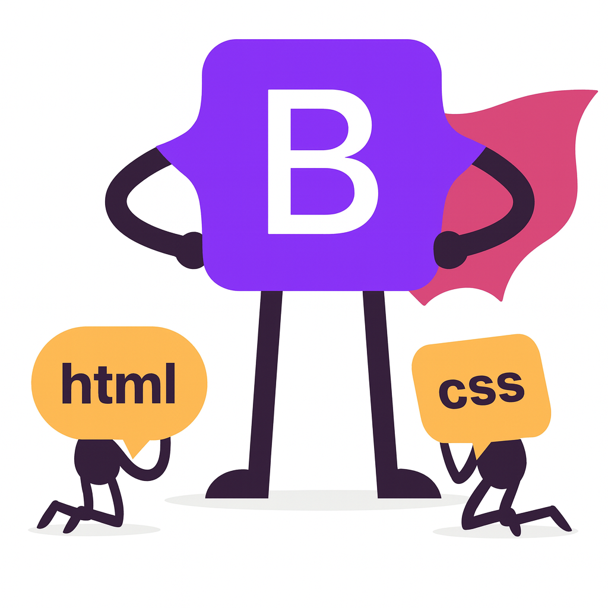
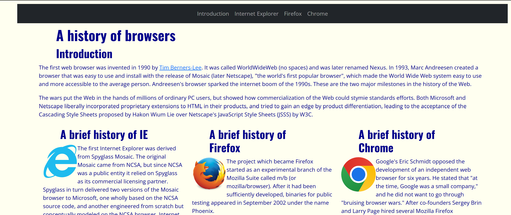

*If HTML and CSS was like building a house, Bootstrap is like playing the sims*

From construction site to sandbox, UI frameworks give you every template you need to create beautiful web pages. UI frameworks such as the one I have recently learned about, Bootstrap, are in fact complicated and can take lots of time and energy to use effectively and efficiently. That being said, they exist for a reason, convenience. After gaining familiarity and experience with a UI framewok, developers can streamline their webpage development while still having a wide variety of options from creative and colorful, to boring and mundane, to everywhere in between. 

## Training Arc

Trivially, in order to build proficiency at Bootstrap I had to of course get some practice. At the moment I first attempted to use Bootstrap, my most relevant experience had been about a week of learning and developing in raw HTML and CSS. The first noticeable advantage to Bootstrap was how much less code was needed to build something like a navigation bar. Because of Bootstrap's template style for specific webpage.

To build the same navigation bar in raw HTML and CSS, it would require far more lines of code and overall more work, time, and effort.

## So... Is it Worth it?

In order to understand the purpose and how to utilize TypeScript's capabilities, my professor had our class first learn the basics of JavaScript. My initial thoughts on JavaScript were, "wow this is just like the other languages I've learned with some slight differences". For example, while Java uses System.out.println, JavaScript uses the shorter console.log in order to print an output to the terminal. Also, instead of declaring the type explicitly like in Java, JavaScript wouldn't require specifying the type and you'd simply use let, const, etc. to declare the variables to which JavaScript will take the liberty of determining the type at runtime. I did find it very convenient however when I found out I would no longer need to do the rather annoying process of concatenating string with additional spaces and plus signs. In JavaScript, you can use backticks (`) which would eliminate the need for those "Hi my name is " + name + " and I like ice cream." scenarios. As I briefly mentioned earlier, one of the most vital (and most difficult to understand) concepts was that in JavaScript, variables aren't fixed i.e. a variable could start out as a number and later hold a string instead. This is quite the drastic change from Java and C which enforced type safety and was a large component of coding in those languages. Took some time to wrap my head around that concept, but with more practice, it began to make sense. Later in the FreeCodeCamp lessons, ES6 and its features were introduced and it gave the language a solid update for lack of better phrasing. The arrow functions and default parameters for example gave what felt like a nice quality of life patch in comparison to the older JavaScript version.  

## Final Takeaways

Ultimately, the process of learning JavaScript then TypeScript had its fair share of road bumps and areas of confusion (90% JavaScript), the transition itself felt smooth and rather fun quite honestly. Actually using my brain and having to pull concepts and prior knowledge from Java/C and corroborating it with what I recently learned about JavaScript provided a unique experience. Compared to the previous languages I had learnt, it was a more enjoyable process and felt rather basic and straightforward in comparison. Maybe it was due to that prior experience that it felt that way, I won't deny it played a large role, but the point still stands. For TypeScript, it was completing a puzzle that I already had all the pieces for, I just needed to place them in their proper location, rather than having to formulate the pieces from scratch. Hopefully that metaphor made sense, it sounded cool in my head at least. Anyway, I'm honestly very excited to continue learning and coding and TypeScript, and I'd encourage any other aspiring software engineers or folks just trying to dabble in a little bit of programming to give it a shot! 

