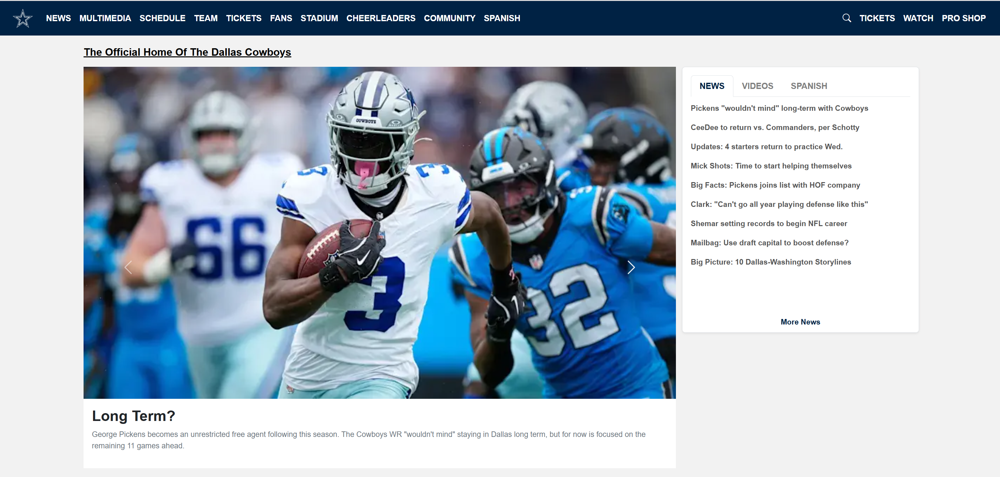

  

This project was a personal project where in my software engineering course we were prompted to recreate a skeleton of a website of our choice. As an NFL and Dallas Cowboys fan (don't pull any punches, I know) I chose their official website as my source to recreate. 

This project was developed using the Bootstrap 5 framework using react and I plan to update this project progressively to further match the functionality of the actual site.

  
  

